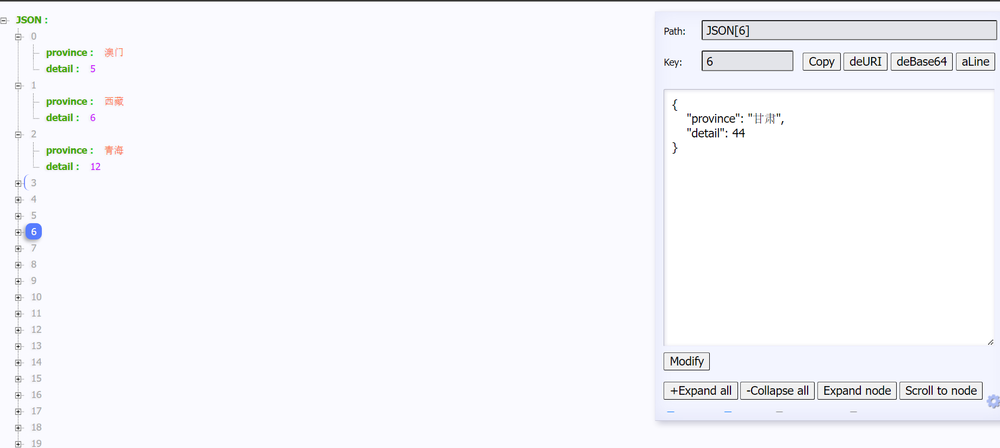
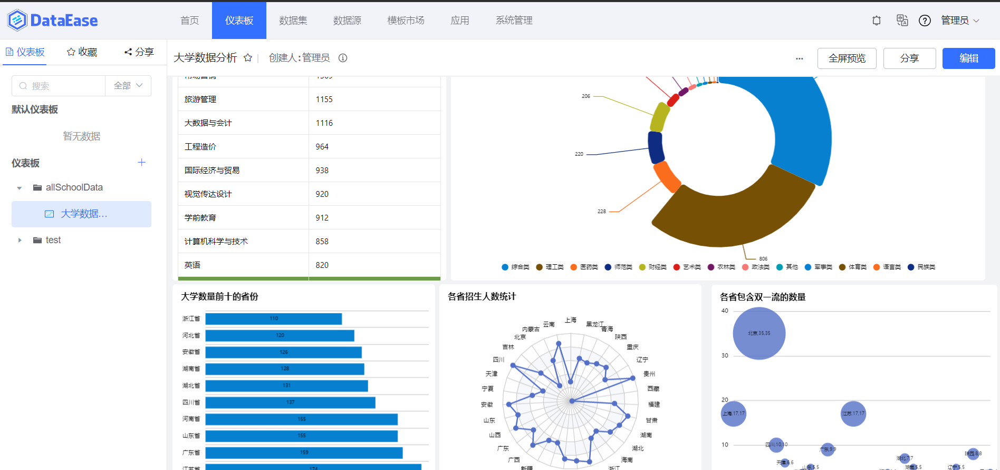

<h1 align="center">Building a Data Information API for Chinese Universities</h1>

<p align="center">
      
</p>

## Repository Introduction

The data in this repository comes from my other repository, ScrapySchoolAll, which uses the Fast API to build custom APIs for anyone to use anywhere. I personally use Data Ease, which is open source by Feizhi Cloud, for graphical analysis

This repository contains：

1. province_count: Each province contains a university.
2. dual_class_count: Each province contains the number of double first-class.
3. type_count: School category statistics.
4. spacial_name_count: All majors statistics.
5. score_province: Admissions Statistics.
6. big_data_count: Statistics of different big data majors.
7. big_data_province_count: Statistics of provincial universities including Big data majors.
8. big_data_type_count: Statistics of universities in provinces with big data majors.
9. big_data_level2_count: Big data secondary category statistics.
10. big_data_level3_count: Big data primary category statistics.
11. big_data_in_dual: Proportion of Big Data in 211/985.
12. big_data_in_null: The proportion of big data in ordinary colleges and universities.
13. artificial_intelligence_in_dual: The proportion of artificial intelligence in 211/985.
14. artificial_intelligence_in_null: The proportion of artificial intelligence in ordinary universities.





## Install

This project uses [Python](https://www.python.org/) [Git](https://git-scm.com/). Go check them out if you don't have them locally installed.

```shell
$ git clone https://github.com/weiensong/allSchoolAPI.git
```


## Usage
```sh
$ pip install -r requriements.txt

# default_config is used to configure tasks in local_runner.py
$ python3 ./local_runner.py
```


## Related Repository

- [python](https://github.com/TheAlgorithms/Python) — All Algorithms implemented in Python
- [fastapi](https://github.com/tiangolo/fastapi) — FastAPI framework, high performance, easy to learn, fast to code, ready for production
- [dataease](https://github.com/dataease/dataeasen) — 人人可用的开源数据可视化分析工具
- [ScrapySchoolAll](https://github.com/weiensong/ScrapySchoolAll) — Hadoop, MapReduce distributed crawling of all Chinese university data for the handheld college entrance examination. (Hadoop,mapreduce分布式爬取掌上高考的所有中国大学数据)


## Related Efforts

- [fastapi](https://fastapi.tiangolo.com/)
- [飞致云](https://www.fit2cloud.com/)


## Maintainers

[@weiensong](https://github.com/weiensong)


## Contributing


Feel free to dive in! [Open an issue](https://github.com/weiensong/allSchoolAPI/issues) or submit PRs.

Standard Python follows the [Python PEP-8](https://peps.python.org/pep-0008/) Code of Conduct.


### Contributors

This project exists thanks to all the people who contribute.


## License

[MIT](LICENSE) © weiensong

